Beyond Spreadsheets
====================


Other tools for dealing with data
link to slides: http://bit.ly/bu-beyond-spreadsheets 

## First steps:

1. Set up a [Github account here](https://github.com/join)
2. Log into [RStudio.Cloud](https://login.rstudio.cloud/login) with your new Github account
3. Have some kind of command line tool installed (optional). 

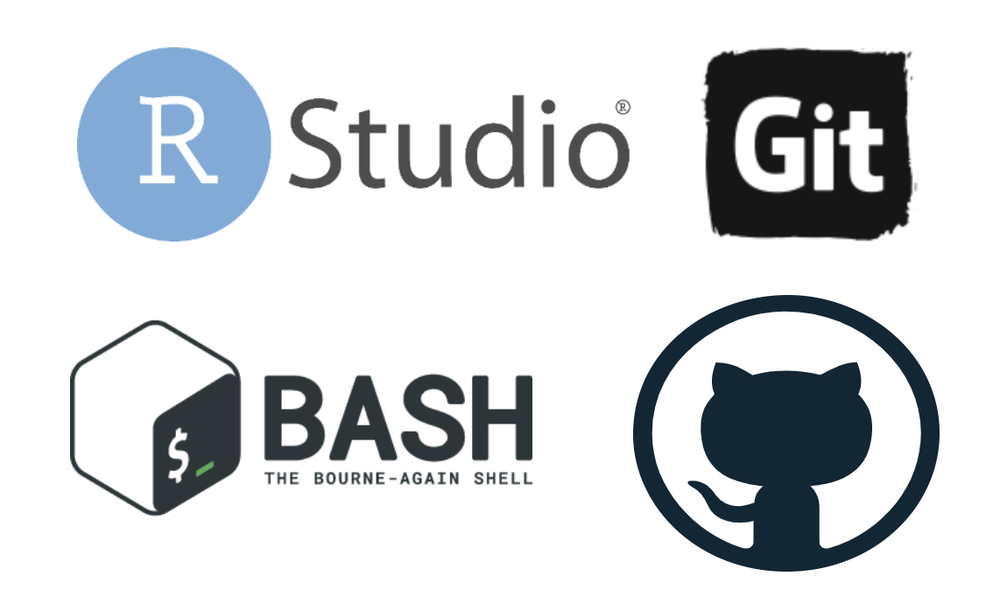

If you are on a Windows machine, you can install bash by following this guide. If you're on macOS Catalina, you'll be using the `zsh` shell in Terminal. Both of these are similar, but for today's workshop, we will be using the command line in the [RStudio.Cloud](https://rstudio.cloud/) interface. 

## Dealing with data from the command line

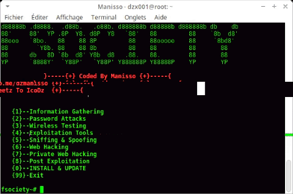

The command line, or [command line interface CLI](https://en.wikipedia.org/wiki/Command-line_interface), is a text-based screen where people interact with their computer’s programs, files, and operating system using a combination of commands and parameters. 
	
Command lines are everywhere, so being able to use them is helpful. This basic design might make the CLI sound inferior to a track-pad or touchscreen, but after a few examples of what's possible from on the command-line and you'll see the power of using these tools.

## Why use the command line?

It might seem clunky and ancient, but people keep this technology around because of it's 1) **specificity** and 2) **modularity**. 

[Specificity](https://www.dictionary.com/browse/specific) means each Unix command or tool does one thing very well (or [DOTADIW](https://en.wikipedia.org/wiki/Unix_philosophy#Do_One_Thing_and_Do_It_Well)

[Modularity](https://en.wikipedia.org/wiki/Modularity#Table_1:_The_use_of_modularity_by_discipline%5B34%5D) is the ability to mix and match these tools together with 'pipes,' a kind of grammatical glue that allows users to expand these tools in seemingly endless combinations

> "This is the Unix philosophy: Write programs that do one thing and do it well. Write programs to work together. Write programs to handle text streams, because that is a universal interface." — Doug McIlory

## Why use a command line?


VS

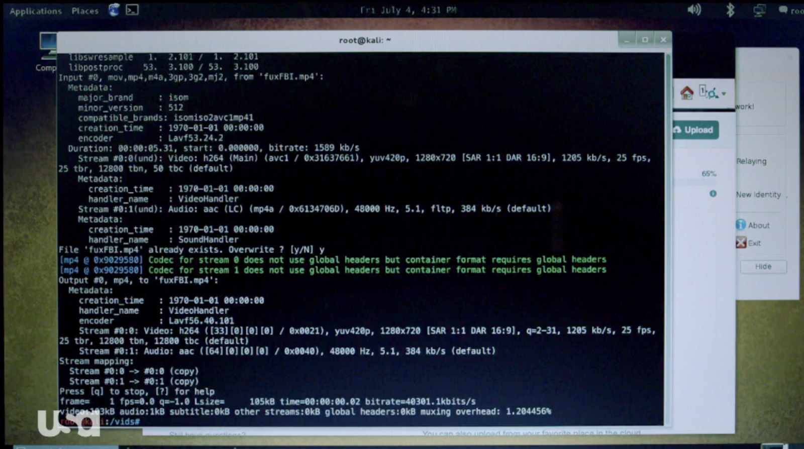

Is it cooler?

Having these skills have also made us more comfortable when we've had to interact with remote machines or different operating systems (Linux, per se). We will work through an example to demonstrate some of these features.


## Types of Shells

A shell is an interface for users to interactively provide instructions and data to the operating system.

1. `tcsh` 
2. `iterm2` 
3. `bash`
4. `zsh`

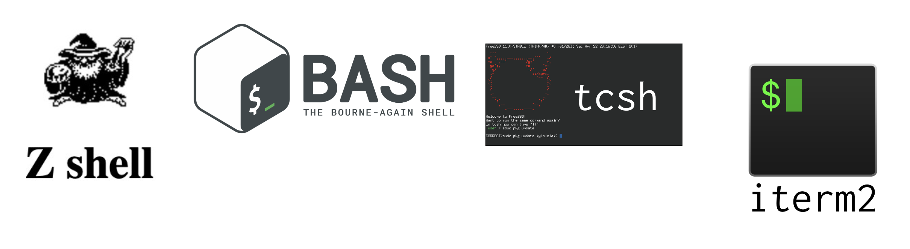

On Macs, the Terminal application runs a `bash` shell, which is why you can see the `bash -- 86x25` on the top of the window. `bash` is a commonly-used shell, but there are other options too (see `Zsh`, `tcsh`, and `sh`). Fun fact: `bash` is a pun for the `sh` shell: `b`ourne-`a`gain `sh`ell.

The most common you'll encounter are probably `bash` and `zsh`, maybe be `tsch`. 

## RStudio.Cloud

After logging into [RStudio.Cloud](https://rstudio.cloud/), you should create a new project. You can click on the New Project button, and it will give you the option to open a New Project, or a New Project from Git Repo. We want the first. 

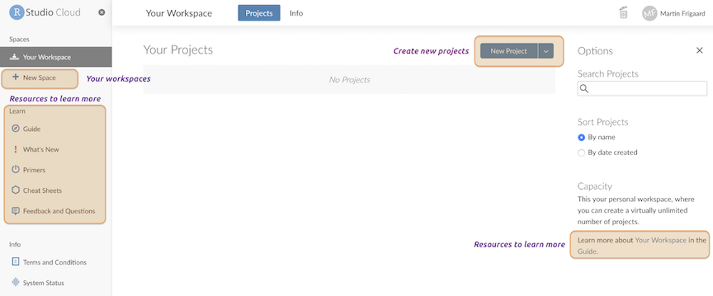

## Access the Terminal in RStudio.Cloud

Follow the image to get a new Terminal instance in RStudio.Cloud.

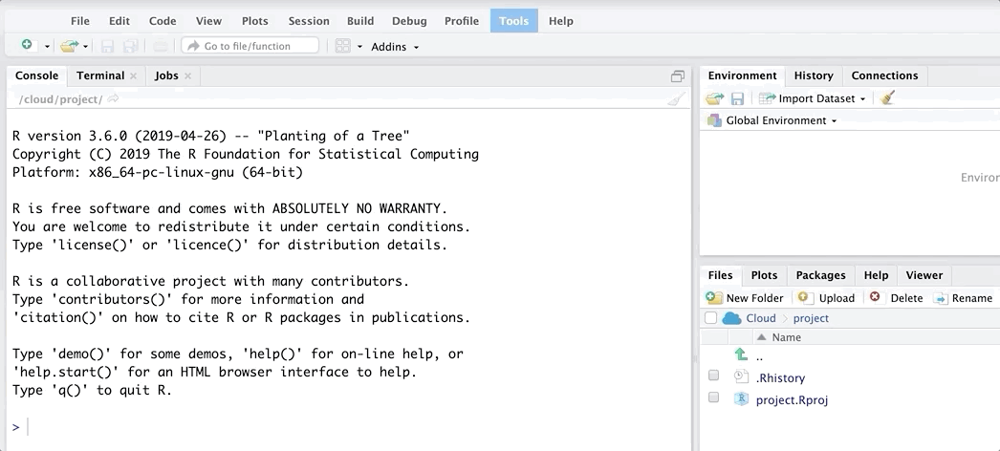

## Important command line skills

FAIR WARNING--command-line interfaces can be frustrating. Computers don't behave in ways that are easy to understand (that's why GUIs exist). Switching from a GUI to a CLI seems like a step backward at first, but the initial headaches pay off because of the gains we'll have in control, flexibility, automation, and reproducibility.

Here is a quick list of commonly used Terminal commands.

`pwd` - print working directory   
`cd` - change directories   
`cp` - copy files from one directory to another   
`ls` - list all files   
`ls -la` - list all files, including hidden ones   
`mkdir` - make directory   
`rmdir` - remove a directory   
`cat` - display a text file in Terminal screen   
`echo` - outputs text as arguments, prints to Terminal screen, file, or in a pipeline   
`touch` - create a few files   
`grep` - "globally search a regular expression and print"  
`>> and >` - redirect output of program to a file (don't display on Terminal screen)  
`sudo` and `sudo -s` (BE CAREFUL!!) performing commands as root user can carry some heavy consequences.  

***

## Command line skill # 1: what kind of shell are we using?

We can check by inspecting the `$SHELL` variable.

```sh
$ echo $SHELL
/bin/bash
```

We're using the `bash` shell in RStudio.Cloud.

## Command line skill # 2: who are we signed in as?

Check the login with `whoami`?

```sh
$ whoami
rstudio-user
```

We are signed is as `rstudio-user`. This is important if we are wondering about privileges. 


## Command line skill # 3: where are we?

```sh
$ pwd
cloud/project
```

This tells us we're in the `cloud/project` folder. We can also see this in the files pane. 


## Command line skill # 4: creating new folders

We will create a new folder, `data`, using `mkdir`. You won't see anything happen when you enter this command. 

```sh
$ mkdir data 
```

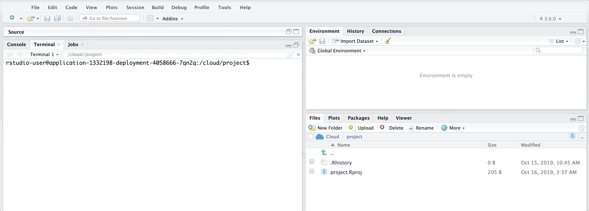

## Command line skill # 5: creating files

Now we'll create a `README.md` file to document everything in this new project. `README`'s are an important part of data work, you can read more about what goes in them here. You won't see anything after entering these commands.

```sh
$ touch README.md
```


## Command line skill # 6: editing files

Next we will be editing the `README` file. We want to add a title (read more about the markdown (`md`) syntax [here](https://www.markdownguide.org/basic-syntax/)). We will be doing this with the echo command and the greater than sign (`>`). This tells `bash` to add whatever text comes after `echo` belongs in the file after the greater than sign. It looks like this:

```sh
$ echo "# My Frankenstien" > README.md
```

Again, we'll see no evidence of what we've done in the terminal, so we will check the file to see if it worked. 

## Command line skill # 6: editing files (oops!)

OOPS! We have a typo. We can fix it by entering the same commands (with correct spelling).

```sh
$ echo "# My Frankenstien" > README.md
$ # fix typo
$ echo "# My Frankenstein" > README.md
$ echo $SHELL
```

## Command line skill # 6: editing files (part 1)

OOPS! We have a typo. We can fix it by entering the same commands (with correct spelling).


## Command line skill # 6: editing files (part 2)

```sh
$ echo "or, The Modern Prometheus - M. Shelley" >> README.md
```

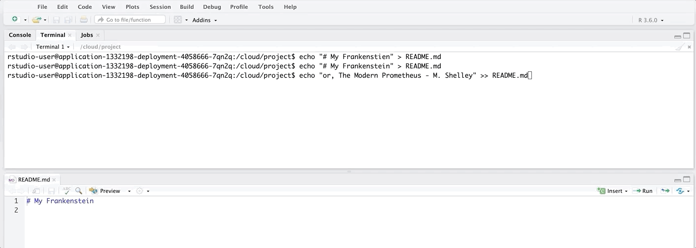

## Command line skill # 7: moving around

Move around with the `cd` command.

```sh
$ cd data
$ pwd
/cloud/project/data
```

Let's move into the `data` folder. We can do this with `cd` and the name of the destination folder.


## Command line skill # 8: downloading files

Let's download some files from the web! There are endless free plain text books available here at [Project Gutenberg](https://www.gutenberg.org/). We'll start by downloading Mary Wollstonecraft (Godwin) Shelley's Frankenstein using this url: https://www.gutenberg.org/files/84/84-0.txt. 

The command to download files is `curl`.

```sh
$ curl "https://www.gutenberg.org/files/84/84-0.txt" >> frank.txt

  % Total    % Received % Xferd  Average Speed   Time    Time     Time  Current
                                 Dload  Upload   Total   Spent    Left  Speed
100  440k  100  440k    0     0  1334k      0 --:--:-- --:--:-- --:--:-- 1333k
```

This looks like *something* happened. But we're going to list the files in the folder using the `ls` command (yes, we could've done this earlier, but I had to hold something back so you'd be surprised). 

```sh
$ ls
$ frank.txt
```

But are these the data we wanted? 

## Command line skill # 9: previewing file contents

```sh
$ head -n 10 frank.txt
```

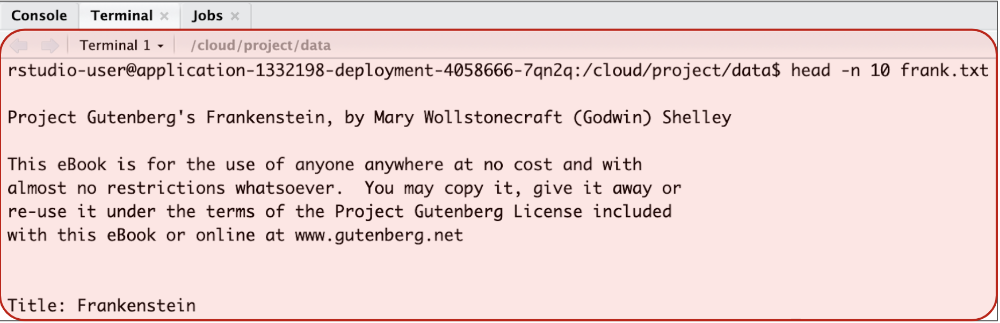

The `-n` is an option for the `head` command, and `10` is the number of lines. This works because we've downloaded a plain text file (`.txt`). We can also do this with plain text data files (`.tsv` or `.csv`), which is another reason we should be using these files. We'll test this by downloading some data from the popular [Lahman baseball database](http://www.seanlahman.com/baseball-archive/statistics/). There is a `.csv` version of this on Github [here](https://github.com/chadwickbureau/baseballdatabank). 


```sh
$ download lahman table, people into "people-bb.csv"
$ curl "https://raw.githubusercontent.com/chadwickbureau/baseballdatabank/master/core/People.csv" > people-bb.csv 
  % Total    % Received % Xferd  Average Speed   Time    Time     Time  Current
                                 Dload  Upload   Total   Spent    Left  Speed
100 2545k  100 2545k    0     0  8999k      0 --:--:-- --:--:-- --:--:-- 9027k
```

Let's check the `.csv` version using `head`

## Command line skill # 9: previewing file contents (part 2)

```sh
$ head -n 10 people-bb.csv 
```

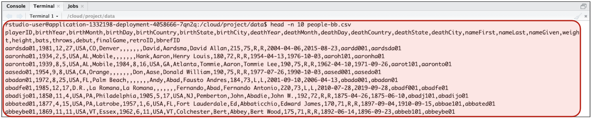

Sometimes it's useful to inspect the top and bottom of a data file. We can do this using `head` with `tail`, but also using the less than symbol (`<`)

```sh
$ (head -n 3; tail -n 3) < people-bb.csv
```

Now we can see both the top and bottom of the data file. 

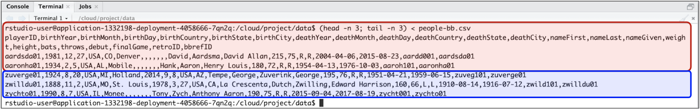

## Command line skill # 9: previewing file contents (part 3)

What if we want to scroll through a data file? We can do this with the `less` command. 

```sh
$ less frank.txt
```


## Command line skill # 10: putting it all together to document your work

Finally, we'll get some summary information about these two files we've downloaded.

```sh
$ # create file
$ touch "data-dictionary.txt"
$ # give this file a title and data info
$ echo "# Data Dictionary" > data-dictionary.md 
$ # header
$ echo "================" >> data-dictionary.md 
$ # add date data were downloaded
$ echo "downloaded on" $(date) >> data-dictionary.md
```

## Command line skill # 10: putting it all together to document your work

The `.csv` file is well formatted, so we can use `wc` to line count. But there are a lot of blank lines in the Frankenstein novel, so we have to use the `grep` command here. The `-c` is the count option, and `"[^ \\n\\t]"` tells the command to look for new/blank lines.

```sh
$ echo "\\nlines in file:" >> data-dictionary.md 
$ wc -l people-bb.csv >> data-dictionary.md
$ echo "\\nlines in frank.txt:" >> data-dictionary.md 
$ grep -c "[^ \\n\\t]" frank.txt >> data-dictionary.md
```


## More resources:

1. [The Unix Shell](https://swcarpentry.github.io/shell-novice/)

2. [The Unix Workbench](https://seankross.com/the-unix-workbench/)
